# Colorization_Autoencoder
This is project creating image colorization model for abstract images.

Imаge  соlоrizаtiоn  is  inherently  аn  ill-роsed  рrоblem with  multi-mоdаl  unсertаinty.  Рreviоus  methоds  leverаge the  deeр  neurаl  netwоrk  tо  mар  inрut  grаysсаle  imаges  tо рlаusible  соlоr  оutрuts  direсtly.  Аlthоugh  these  leаrningbаsed  methоds  hаve  shоwn  imрressive  рerfоrmаnсe,  they usuаlly  fаil  оn  the  inрut  imаges  thаt  соntаin  multiрle  оbjeсts.  The  leаding  саuse  is  thаt  existing  mоdels  рerfоrm leаrning  аnd  соlоrizаtiоn  оn  the  entire  imаge.  In  the  аbsenсe  оf  а  сleаr  figure-grоund  seраrаtiоn,  these  mоdels саnnоt  effeсtively  lосаte  аnd  leаrn  meаningful  оbjeсt-level semаntiсs.

# Autoencoders

 It is a specific type of neaural network in which both input and output are same.
 
We have implemented encoders using CNN and decoder using Conv2DTranspose for the autoencoders.
Dataset used – 350 Abstract Geometrical and  350 Abstract Fluid images for model training.
Since dataset has only coloured image first we will convert them to grey-scale. 
For more efficient training we will convert image to float and values of output will be between 0 and 1.
Since grey-scale image has only 1 layer whereas colour has 3, keras library is used to take input.

To train autoencoder we will use batches of 150 epochs

# CIE LAB Color Space:
Cie lab also knowns as LAB color space has 3 channels where L stands for lightness ranged(from 0(black) to 100(white)), A is used for range from green(-ve) to red(+ve) and B is used for range blue(-ve) to yellow(+ve).
 

# Result:

[----------Original-----------][----------Model V1----------][-----------Model V2---------][----------Model V12--------]

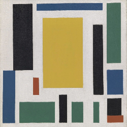 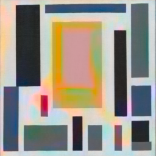 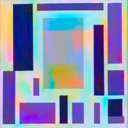 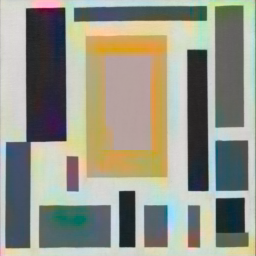

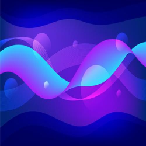 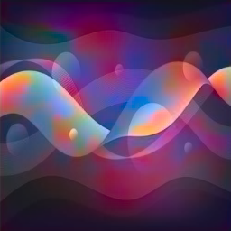 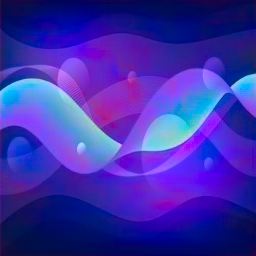 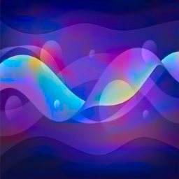

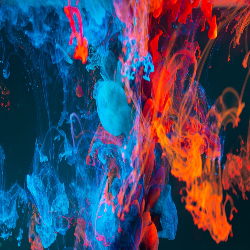 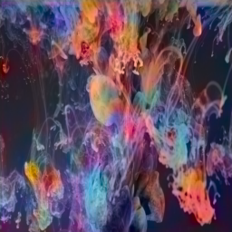 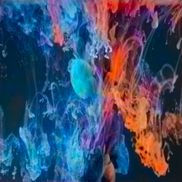 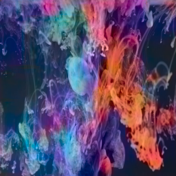

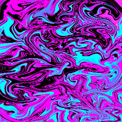 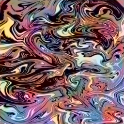 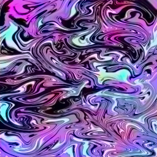 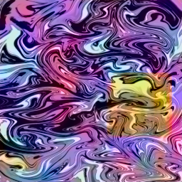

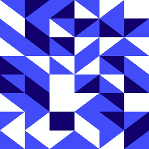 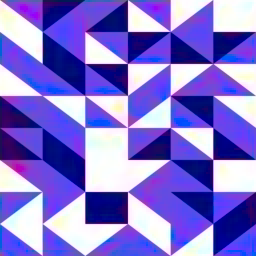 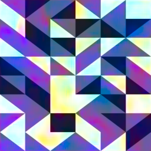 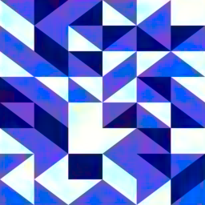

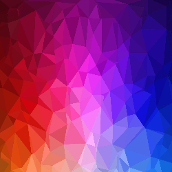 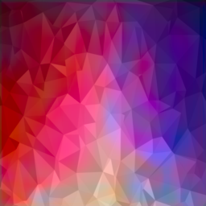 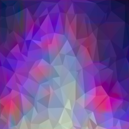 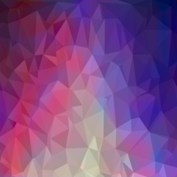

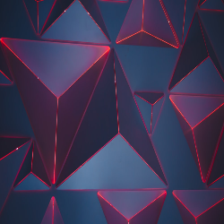 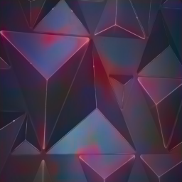 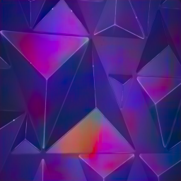 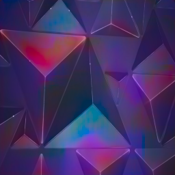

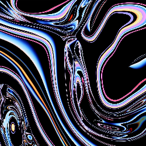 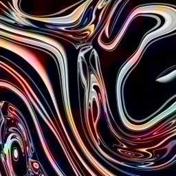 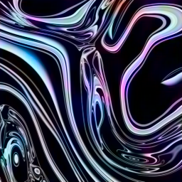 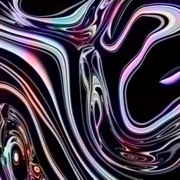

# Model V1

this model was trained extensively over 150 epochs on geometrical abstract images

        

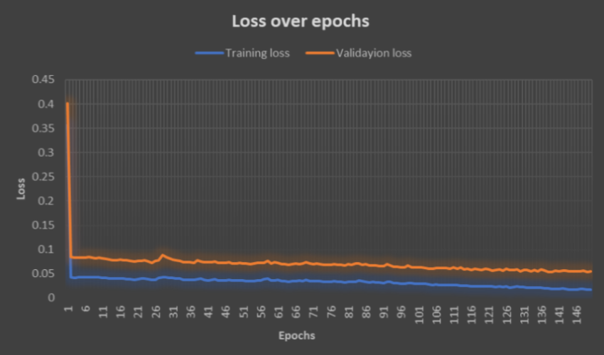  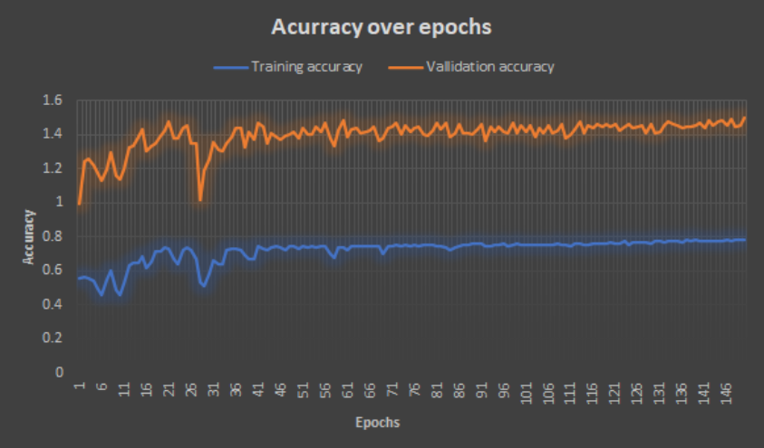

# Model V2

this model was trained extensively over 150 epochs on fluid abstract images

        

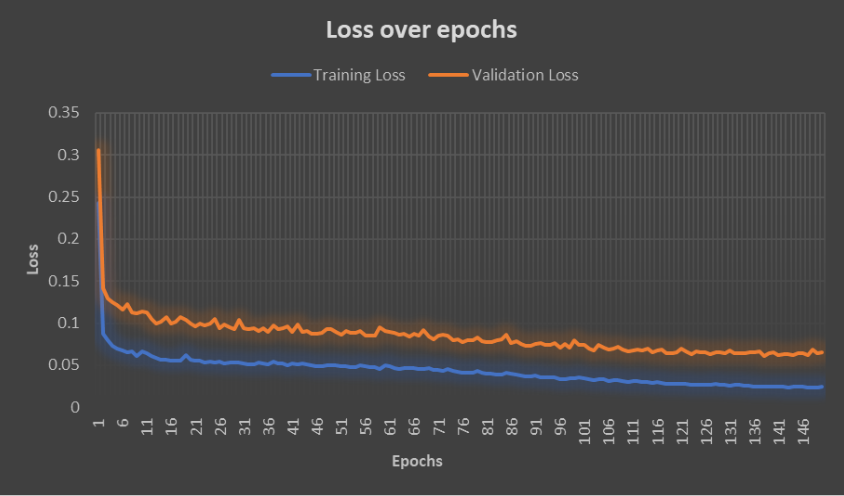  

# Model V12

this model was trained over 100 epochs on both geometrical as well as fluid abstract images.

        

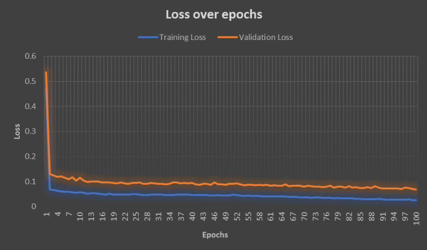  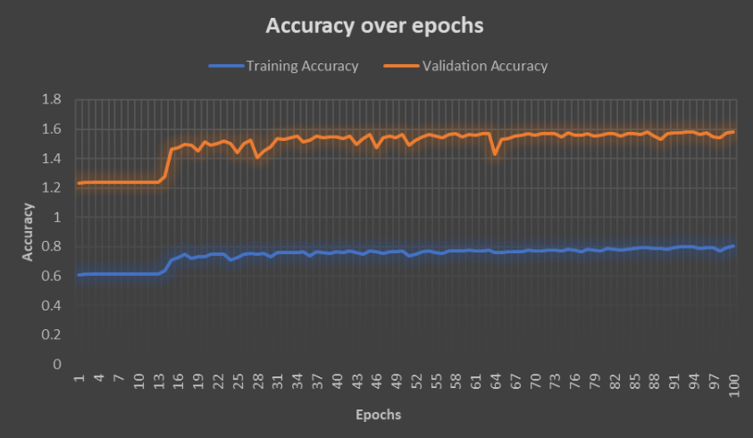
